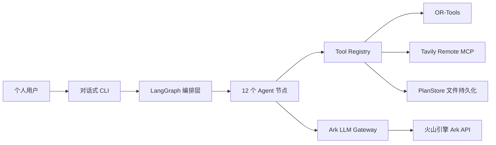

# 02｜系统架构设计

## 1. 设计目标

- 将 LLM 生成限制在可验证的业务边界内，关键计算由确定性工具完成。
- 所有外部数据通过工具获取并可审计，禁止硬编码业务数据。
- 支持长流程暂停、恢复、局部重试和人工介入。
- 每个 LangGraph 节点直接绑定所需的 Tools，职责清晰、便于测试。

## 2. 总体架构

## 3. 分层设计

### 交互层

技术：Python CLI（`cli.py`）。

职责：
- LLM 主导的对话式需求收集（自由文本，无固定表单）。
- 展示工作流执行结果（行程、报价、质量报告）。
- 提供交互式审批（批准/驳回）。

### 编排层

技术：LangGraph StateGraph。

职责：
- 管理 12 个节点的状态传递和条件路由。
- 约束失败时触发应急替代和重试（最多 2 次）。
- 在审批节点通过 `interrupt` 暂停，等待人工决策后 `Command(resume=...)` 恢复。

节点清单：

| 节点 | 类型 | 绑定的 Tools / 数据来源 |
|---|---|---|
| parse_requirements | LLM | Ark（需求解析） |
| retrieve_resources | Tool + LLM | search_attractions（Tavily MCP）+ Ark（资源充实） |
| plan_itinerary | LLM + Tool | calculate_route_matrix + optimize_itinerary（OR-Tools）+ Ark（交通估算、行程编排） |
| validate_constraints | 确定性 | 规则校验（每日跨度、空日程） |
| repair_plan | Tool | search_attractions（应急替代搜索） |
| calculate_quote | LLM + Tool | Ark（成本估算）+ calculate_product_cost |
| quality_review | LLM | Ark（多维度评分） |
| approval_gate | 人工 | CLI 交互（interrupt） |
| prepare_poster | 适配器 | ComfyUI（待部署）/ Mock |
| finalize_delivery | Tool | save_plan_version + submit_for_approval（PlanStore） |
| mark_failed | 终端 | — |
| mark_rejected | 终端 | — |

### 能力层

技术：Tool Registry。

- 6 个注册工具，Pydantic 输入校验。
- 三级风险分级：READ_ONLY / WRITE_INTERNAL / EXTERNAL_ACTION。
- 每个节点直接调用自己需要的工具，不存在中间 Skill 调度层。
- 所有工具接受真实数据输入，不包含硬编码业务数据。

### 模型层

技术：火山引擎 Ark（OpenAI-compatible API）。

- 单一模型 `ark-code-latest` 用于所有 LLM 节点。
- 结构化输出：`response_format: json_object` + 字段描述注入。
- 思考模式已禁用（`thinking: {"type": "disabled"}`），降低延迟。
- 每个 LLM 调用有独立超时（30-60s），失败后降级或抛出异常。

### 数据层

当前：JSON 文件持久化（PlanStore）。
- 方案版本：`data/plans/{plan_id}/v{N}.0.json`
- 审批记录：`data/plans/{plan_id}/approval.json`

规划：PostgreSQL + PostGIS + pgvector（初始化脚本已提供，见 `infra/postgres/init.sql`）。

## 4. 故障与降级策略

| 故障场景 | 处理方式 |
|---|---|
| Ark LLM 超时或返回无效 JSON | 需求解析降级到默认值；行程编排降级到基础布局；成本/质检抛出异常 |
| Tavily MCP 搜索失败 | 抛出异常（无演示数据降级） |
| OR-Tools 无解 | 抛出 RuntimeError |
| 约束校验失败 | 触发应急替代搜索，最多重试 2 次后进入 mark_failed |
| ComfyUI 不可用 | `MOCK_IMAGEGEN=true` 返回预处理素材 |
