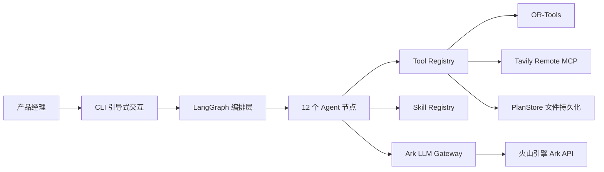

# 02｜系统架构设计

## 1. 设计目标

- 将 LLM 生成限制在可验证的业务边界内，关键计算由确定性工具完成。
- 所有外部数据通过工具获取并可审计，禁止硬编码业务数据。
- 支持长流程暂停、恢复、局部重试和人工介入。
- 通过 Skill 门禁实现不同产品类型的差异化质量控制。

## 2. 总体架构

## 3. 分层设计

### 交互层

技术：Python CLI（cli.py）。

职责：
- 引导式收集产品需求（分步问答 + 自由补充）。
- 展示工作流执行结果（行程、报价、质量报告）。
- 提供交互式审批（批准/驳回）。

### 编排层

技术：LangGraph StateGraph。

职责：
- 管理 12 个节点的状态传递和条件路由。
- 约束失败时触发应急替代和重试（最多 2 次）。
- 在审批节点通过 `interrupt` 暂停，等待人工决策后 `Command(resume=...)` 恢复。

节点清单：

| 节点 | 类型 | 数据来源 |
|---|---|---|
| parse_requirements | LLM | Ark（需求解析） |
| retrieve_resources | Tool + LLM | Tavily MCP + Ark（资源充实） |
| plan_itinerary | LLM + Tool | Ark（交通估算 + 行程编排）+ OR-Tools |
| validate_constraints | 确定性 | Skill 门禁值 |
| repair_plan | Tool | Tavily MCP（应急替代搜索） |
| calculate_quote | LLM + Tool | Ark（成本估算）+ 计价工具 |
| quality_review | LLM | Ark（多维度评分） |
| approval_gate | 人工 | CLI 交互 |
| prepare_poster | 适配器 | ComfyUI（待部署）/ Mock |
| finalize_delivery | Tool | PlanStore（版本持久化） |
| mark_failed | 终端 | — |
| mark_rejected | 终端 | — |

### 能力层

技术：Tool Registry + Skill Registry。

Tool Registry：
- 6 个注册工具，Pydantic 输入校验。
- 三级风险分级：READ_ONLY / WRITE_INTERNAL / EXTERNAL_ACTION。
- 所有工具接受真实数据输入，不包含硬编码业务数据。

Skill Registry：
- 7 个业务 Skill，从 `manifest.yaml` + `SKILL.md` 加载。
- 每个 Skill 定义 `quality_gates`（如 `max_daily_minutes`、`max_continuous_transport_minutes`）。
- 门禁值在约束校验和质量审核中被真实读取和执行。
- Skill 指令（SKILL.md）注入 LLM 提示词，影响策划行为。

### 模型层

技术：火山引擎 Ark（OpenAI-compatible API）。

- 单一模型 `ark-code-latest` 用于所有 LLM 节点。
- 结构化输出：`response_format: json_object` + 字段描述注入。
- 思考模式已禁用（`thinking: {"type": "disabled"}`），降低延迟。
- 每个 LLM 调用有独立超时（30-60s），失败后降级或抛出异常。

### 数据层

当前：JSON 文件持久化（PlanStore）。
- 方案版本：`data/plans/{plan_id}/v{N}.json`
- 审批记录：`data/plans/{plan_id}/approval.json`

规划：PostgreSQL + PostGIS + pgvector（初始化脚本已提供）。

## 4. 故障与降级策略

| 故障场景 | 处理方式 |
|---|---|
| Ark LLM 超时或返回无效 JSON | 需求解析降级到规则映射；其他节点抛出异常终止 |
| Tavily MCP 搜索失败 | 抛出异常（无演示数据降级） |
| OR-Tools 无解 | 抛出 RuntimeError |
| 约束校验失败 | 触发应急替代搜索，最多重试 2 次 |
| ComfyUI 不可用 | `MOCK_IMAGEGEN=true` 返回预处理素材 |
