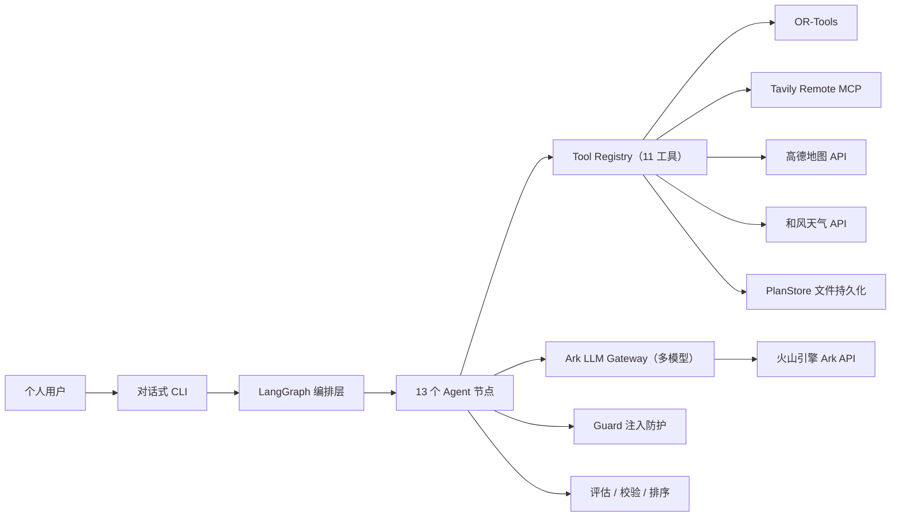

# 02｜系统架构设计

## 1. 设计目标

- 将 LLM 生成限制在可验证的业务边界内，关键计算由确定性工具完成。
- 所有外部数据通过工具获取并可审计，禁止硬编码业务数据。
- 支持长流程暂停、恢复、局部重试和人工介入。
- 每个 LangGraph 节点直接绑定所需的 Tools，职责清晰、便于测试。
- 外部内容默认不可信：检索结果先经过注入防护再进入 LLM 上下文。

## 2. 总体架构

## 3. 分层设计

### 交互层

技术：Python CLI（`cli.py`）+ 可选 FastAPI（`app/main.py`）。

职责：
- LLM 主导的对话式需求收集（自由文本，无固定表单，基于 `chat_graph`）。
- 展示工作流执行结果（行程、报价、质量报告）。
- 提供交互式审批（批准/驳回），通过 `Command(resume=...)` 恢复。
- REST API 提供 `/chat`、`/plans/run`、SSE 流式进度与审批端点。

### 编排层

技术：LangGraph StateGraph。

职责：
- 管理 13 个节点的状态传递和条件路由。
- 约束失败时触发应急替代和重试（最多 2 次）；审核失败时进入修复环路（最多 2 次）。
- 在 `approval_gate` 节点通过 `interrupt()` 暂停，等待人工决策后恢复，并按批准/驳回路由。

节点清单（`app/agents/graph.py`）：

| 节点 | 类型 | 绑定的 Tools / 数据来源 |
|---|---|---|
| retrieve_resources | Tool + LLM | search_attractions（Tavily）+ search_poi_amap（高德）+ Guard 过滤 + 评分排序 + Ark 多模态充实 |
| plan_itinerary | Tool + LLM | calculate_route_matrix（内部调用高德真实时长）+ optimize_itinerary（OR-Tools）+ get_weather_forecast（和风天气）+ Ark（交通估算、行程编排，结合天气） |
| validate_constraints | 确定性 | 规则校验（空日程、时间冲突、每日跨度、必去覆盖、预算偏差） |
| repair_plan | Tool | search_attractions（应急替代搜索） |
| calculate_quote | LLM + Tool | Ark（成本估算）+ calculate_product_cost |
| quality_review | LLM | Ark（多维度评分） |
| run_verification | 确定性 | verifier 8 项可行性检查 |
| review_repair | 确定性 | 重排触发（推进重试计数，回到 plan_itinerary） |
| prepare_poster | 适配器 | PosterService（ComfyUI / Mock），按天智能生成 1-3 张分日插图 |
| approval_gate | 人工中断 | `interrupt()` 暂停等待审批，批准 → finalize_delivery，驳回 → mark_rejected |
| finalize_delivery | Tool | render_markdown_report + build_pdf_report + plan_store.save_version + submit_for_approval |
| mark_failed | 终端 | — |
| mark_rejected | Tool | submit_for_approval（记录驳回决定） |

### 能力层

技术：Tool Registry（`app/tools/registry.py`）。

- 7 个注册工具，Pydantic 输入校验。
- 三级风险分级：READ_ONLY / WRITE_INTERNAL / EXTERNAL_ACTION。
- 每个节点直接调用自己需要的工具，不存在中间 Skill 调度层。
- 异步工具必须通过 `ainvoke` 调用，误用 `invoke` 立即报错。
- `ainvoke` 用于所有异步 I/O 工具（如 MCP 网络调用）。

工具清单见 [04-Tools设计](./04-Tools设计.md)。

### 模型层

技术：火山引擎 Ark（OpenAI-compatible API），多模型分层：

| 配置项 | 默认值 | 用途 |
|---|---|---|
| `LLM_MODEL` | `ark-code-latest` | 默认模型 |
| `LLM_MODEL_COMPLEX` | `DeepSeek-V4-Pro` | 资源充实、交通估算、行程编排、成本核算、质量审核 |
| `LLM_MODEL_SIMPLE` | `Doubao-Seed-2.0-lite` | 对话式需求收集（chat_graph） |
| `LLM_MODEL_MULTIMODAL` | `Doubao-Seed-2.1-turbo` | 资源充实（可携带图片）、CLI 对话 |

- 结构化输出：`response_format: json_object` + 字段描述注入（`_schema_hint`）。
- 思考模式已禁用（`thinking: {"type": "disabled"}`），降低延迟。
- 每个 LLM 调用有独立超时（30-60s），失败即抛出异常。

### 防护与数据层

防护：`app/services/guard.py`
- 正则模式检测 Prompt Injection（系统指令覆盖、角色劫持、工具调用注入、数据外泄、DoS 循环等）。
- 域名白名单/黑名单过滤资源来源，`filter_resources` 在检索节点即时执行。

数据：
- JSON 文件持久化（PlanStore）：方案版本 `data/plans/{plan_id}/v{N}.0.json`、审批记录 `approval.json`、报告 `report.md` / `report.pdf`、海报素材。

## 4. 故障与错误处理

外部 API（LLM / Tavily / 高德 / 天气 / ComfyUI）**不做静默降级**：未配置或调用失败时工作流立即失败，错误信息由 API/前端显示，由用户处理配置或网络问题。

| 故障场景 | 处理方式 |
|---|---|
| Ark LLM 超时或返回无效 JSON | 抛出异常，工作流失败 |
| Tavily 搜索失败 / 未配置 | 抛 `MCPToolError`，工作流失败 |
| 高德未配置 / 请求失败 | 抛错提示（`AMAP_API_KEY` / 调用失败），工作流失败 |
| 天气未配置 / 请求失败 | 抛错提示（`WEATHER_API_KEY` / 调用失败），工作流失败 |
| OR-Tools 无解 | 抛出 RuntimeError |
| 约束校验失败 | 触发应急替代搜索，共用 retry_count 合计最多 2 次后进入 mark_failed |
| 质量/可行性审核不达标 | 进入 review_repair 重排环路，共用 retry_count 合计最多 2 次后进入 mark_failed |
| ComfyUI 不可用 | 真实模式（`MOCK_IMAGEGEN=false`）失败即抛错；默认 Mock 模式不调用 |
