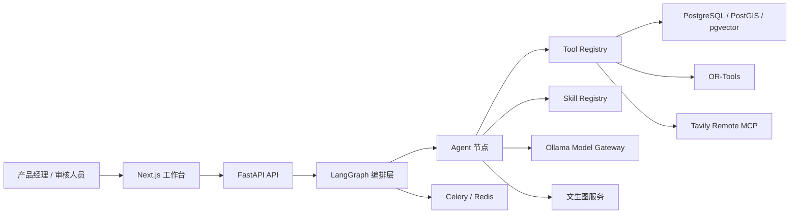
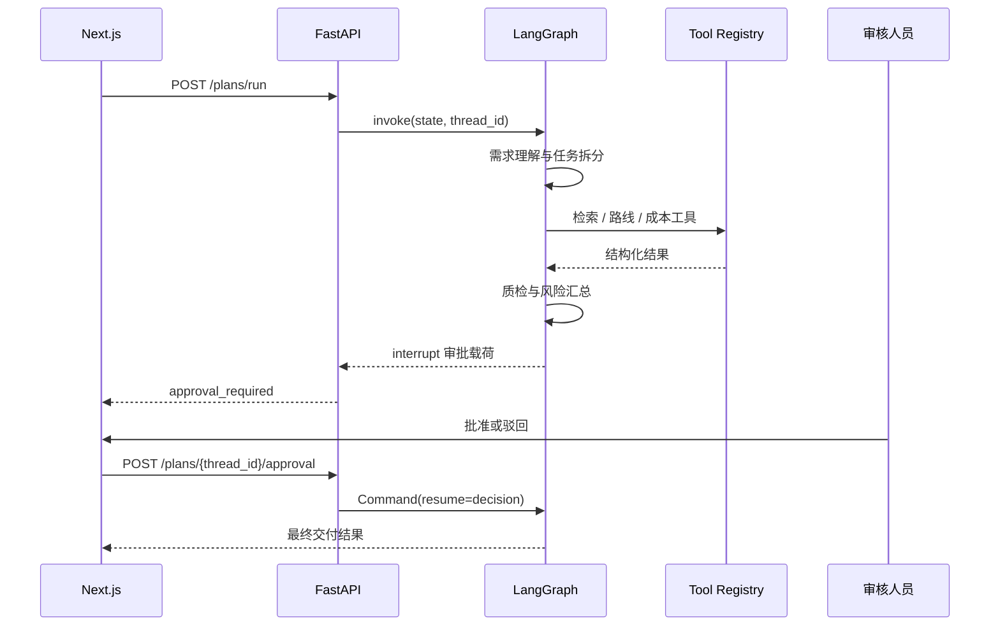

# 02｜系统架构设计

## 1. 设计目标

架构围绕四个目标展开：

- 将不稳定的模型生成限制在可验证的业务边界内。
- 让检索、计算、写入等动作通过工具完成并可审计。
- 支持长流程暂停、恢复、局部重试和人工介入。
- 在本地小模型条件下，通过模型路由控制资源消耗。

## 2. 总体架构



演示模式下，部分依赖使用确定性数据或 Mock 适配器，以便在没有外部模型和数据库时仍能完成端到端展示。

## 3. 分层设计

### 体验层

技术：Next.js、React、TypeScript、Tailwind CSS。

职责：

- 收集策划需求。
- 展示工作流阶段、方案、成本、风险和审批状态。
- 提供 Tools、Skills 和系统架构的可视化入口。

体验层不直接调用模型或数据库，所有业务动作通过 API 发起。

### API 层

技术：FastAPI、Pydantic。

职责：

- 校验请求参数。
- 创建和恢复 LangGraph 线程。
- 提供工具、技能元数据。
- 统一返回结构和错误边界。

### 编排层

技术：LangGraph。

职责：

- 管理共享的 `PlanningState`。
- 按条件边调度 Agent 节点。
- 在质检失败时决定返工方向。
- 在最终交付前暂停并等待人工审批。

### 能力层

由 Agent、Tools 和 Skills 组成：

- Agent：围绕一个业务职责做判断和组织。
- Tool：执行确定性的查询、计算或写入。
- Skill：描述可复用的业务方法、输入输出和安全要求。

### 数据与基础设施层

- PostgreSQL：方案、版本、运行记录和工具调用。
- PostGIS：地理位置和空间查询。
- pgvector：资源语义向量。
- Redis：缓存、队列和异步任务协调。
- Celery：长耗时或可异步执行的任务骨架。

## 4. 一次请求的执行路径



## 5. 模块职责

| 模块 | 职责 | 不负责 |
| --- | --- | --- |
| `frontend/` | 交互和信息呈现 | 模型编排、持久化 |
| `backend/app/api/` | HTTP 协议与参数校验 | 复杂业务推理 |
| `backend/app/graph/` | 状态图和流程控制 | 具体数据库实现 |
| `backend/app/agents/` | 单一业务职责 | 任意外部写入 |
| `backend/app/tools/` | 确定性动作与风险元数据 | 自主决策 |
| `backend/app/skills/` | 业务方法和复用规范 | 执行时状态存储 |
| `backend/app/services/` | 模型、海报等外部能力适配 | 页面逻辑 |
| `infra/` | 数据库初始化和部署配置 | 业务规则 |

## 6. 部署拓扑

本地开发可以分成两种形态：

- 轻量模式：前端和后端直接运行，使用内存 checkpoint 与演示数据。
- 完整依赖模式：Docker Compose 启动前端、API、PostgreSQL 和 Redis，并按需连接 Ollama。

生产环境建议拆分：

```text
CDN / 网关
  └─ Next.js
      └─ FastAPI 多副本
          ├─ LangGraph Worker
          ├─ Celery Worker
          ├─ PostgreSQL + PostGIS + pgvector
          ├─ Redis
          ├─ Ollama / 模型服务
          └─ 文生图服务
```

## 7. 故障与降级边界

| 故障 | 建议策略 |
| --- | --- |
| 模型超时 | 有上限地重试，切换备用模型，保留失败节点上下文 |
| 检索无结果 | 放宽过滤条件，但明确标记证据不足 |
| 路线求解无解 | 返回冲突约束，允许人工删除或降级某项活动 |
| 海报生成失败 | 不阻断已批准的行程交付，返回可重试状态 |
| 数据库短暂不可用 | 只重试幂等读取；写入使用事务和幂等键 |
| 审批长期未处理 | 保持 checkpoint，通知负责人，不自动批准 |

## 8. 当前实现与生产化差距

| 领域 | 当前实现 | 生产化建议 |
| --- | --- | --- |
| Checkpoint | `MemorySaver` | PostgreSQL 持久化 checkpoint |
| 资源数据 | Tavily MCP 实时网页检索；无密钥时可降级到内存演示数据 | 供应商同步、官方数据优先级与数据质量管理 |
| 模型 | 网关适配层 | 接入主流程、熔断、配额和回退 |
| 异步任务 | Celery 配置骨架 | Worker、重试队列、死信和任务观测 |
| 鉴权 | 未实现完整租户体系 | OIDC、RBAC、租户隔离 |
| 观测 | 基础日志 | OpenTelemetry、指标面板和 Prompt 追踪 |
| 工具协议 | 本地 Tool Registry + Tavily Remote MCP Client | 将内部地图和资源库进一步封装为 MCP Server |
