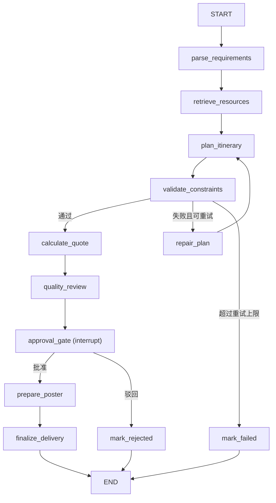

# 03｜多 Agent 与 LangGraph 工作流

## 1. 核心概念

本项目对几个容易混淆的概念做如下约定：

- Agent：对一个业务目标负责，能够读取状态、做判断并调用工具。
- Graph Node：LangGraph 中可执行的函数。一个 Agent 映射为一个节点。
- Tool：具有明确参数和结果的确定性动作，通过 Tool Registry 注册。
- State：整个策划线程共享的结构化上下文（`PlanningState`）。

项目避免让多个 Agent 无限制互相聊天，而是使用有向状态图建立可预测的执行顺序。每个节点直接绑定自己需要的 Tools，不存在中间 Skill 调度层。

## 2. 节点分工

| 节点 | 主要职责 | 典型输入 | 典型输出 |
| --- | --- | --- | --- |
| parse_requirements | 解析用户目标和约束 | PlanRequest | 需求完整性判断 |
| retrieve_resources | 检索并充实候选资源 | 目的地、主题、人群 | ResourceCandidate[] |
| plan_itinerary | 估算交通、优化路线、编排行程 | 候选资源、天数 | ItineraryDay[]、路线矩阵 |
| validate_constraints | 检查每日跨度等硬性约束 | 行程 | ConstraintReport |
| repair_plan | 约束失败时搜索替代资源 | 问题清单 | 补充后的资源 |
| calculate_quote | 估算成本并计算售价 | 行程、人数、预算 | Quote |
| quality_review | 多维度质量评分 | 完整方案 | QualityReport |
| approval_gate | 人工审批中断 | 方案 + 质量报告 | 审批决定 |
| prepare_poster | 生成海报视觉资产 | 方案 Brief | 海报资产 |
| finalize_delivery | 存档版本与审批记录 | 已批准方案 | 持久化结果 |

## 3. 状态机



`repair_plan → plan_itinerary` 构成返工环路，由 `retry_count` 限制最多 2 次，超过后转入 `mark_failed`，避免死循环。

## 4. `PlanningState`

共享状态定义在 `app/agents/state.py`：

```python
class PlanningState(TypedDict, total=False):
    thread_id: str
    plan_id: str
    request: PlanRequest
    requirements_complete: bool
    missing_fields: list[str]
    resources: list[ResourceCandidate]
    resource_search_provider: str
    route_matrix: dict[str, int]
    itinerary: list[ItineraryDay]
    constraint_report: ConstraintReport
    quote: Quote
    quality_report: QualityReport
    approval: dict[str, Any]
    poster_brief: PosterBrief
    poster_asset: dict[str, str]
    current_stage: str
    retry_count: int
    errors: list[str]
```

设计原则：

- 节点只写入自己负责的字段。
- 字段都是可校验的 Pydantic 对象，而不是大段自由文本。
- 错误作为状态的一部分传递，使路由函数可以决定重试或终止。

## 5. 条件边

两个条件路由函数都是确定性 Python 逻辑，便于单元测试：

- `constraint_route`：校验通过 → `calculate_quote`；失败且 `retry_count < 2` → `repair_plan`；否则 → `mark_failed`。
- `approval_route`：批准 → `prepare_poster`；驳回 → `mark_rejected`。

业务决策从 Prompt 中抽离到路由函数，模型只负责生成内容，不负责流程控制。

## 6. 人工审批的中断与恢复

LangGraph 的 `interrupt` 用于把当前状态暂停在审批关口：

1. 图执行到 `approval_gate`。
2. 节点调用 `interrupt(...)`，抛出包含方案 ID 和质量报告的审批载荷。
3. checkpointer 保存当前线程状态。
4. CLI 展示方案并等待用户输入。
5. 用户提交决定（批准/驳回）。
6. CLI 使用 `Command(resume={"approved": ...})` 恢复同一线程。

当前使用 `MemorySaver`，进程重启后状态会丢失。生产环境应改用持久化 checkpoint，并保证 `thread_id` 唯一。

## 7. 节点实现约束

一个合格节点应具备：

- 明确的输入字段和输出字段。
- 对模型输出进行 Pydantic 校验（`ModelGateway.structured_completion`）。
- 对 Tool 调用区分同步 `invoke` 与异步 `ainvoke`。
- LLM 调用设置独立超时，失败后降级或抛出异常。
- 不在节点中硬编码业务数据。

示例结构：

```python
async def calculate_quote(state: PlanningState) -> dict:
    breakdown = await gateway.structured_completion(
        system_prompt=COST_ESTIMATION_SYSTEM,
        user_prompt=...,
        schema=CostBreakdown,
    )
    quote = tool_registry.invoke("calculate_product_cost", {...})
    return {"quote": quote, "current_stage": "quote_calculated"}
```

## 8. 重试与幂等

- 模型生成：可以重试，结构化输出失败时降级到确定性逻辑或抛出异常。
- 查询工具（search_attractions）：可安全重试。
- 计算工具（route_matrix、product_cost）：相同输入产生相同结果。
- 保存版本：使用 `plan_id + version` 自增，快照不可变。

## 9. 如何增加一个节点

1. 定义业务职责和输入输出字段。
2. 在 `PlanningState` 中增加最小必要字段。
3. 编写节点函数，直接调用所需的 Tools / LLM。
4. 在 `build_planning_graph` 中注册节点和边。
5. 为成功、失败和超时增加条件边。
6. 编写节点级测试（Mock LLM 与 Tool）。
