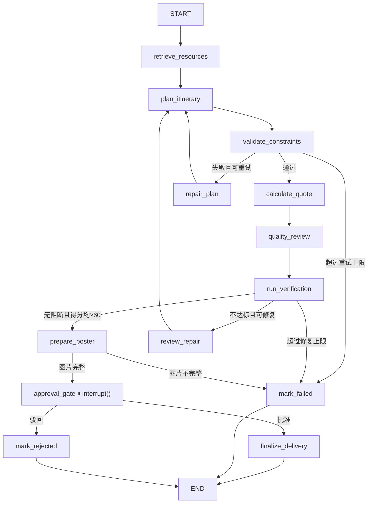

# 03｜多 Agent 与 LangGraph 工作流

## 1. 核心概念

本项目对几个容易混淆的概念做如下约定：

- Agent：对一个业务目标负责，能够读取状态、做判断并调用工具。
- Graph Node：LangGraph 中可执行的函数。一个 Agent 映射为一个节点。
- Tool：具有明确参数和结果的确定性动作，通过 Tool Registry 注册。
- State：整个策划线程共享的结构化上下文（`PlanningState`）。
- interrupt：LangGraph 的暂停原语，用于在交付前等待人工审批。

项目避免让多个 Agent 无限制互相聊天，而是使用有向状态图建立可预测的执行顺序。每个节点直接绑定自己需要的 Tools，不存在中间 Skill 调度层。

另外，对话式需求收集独立成图（`app/agents/chat_graph.py`），负责把自然语言对话转成结构化 `PlanRequest`。它强制执行必要信息、额外注意事项和用户确认三道门禁，Web 与 CLI 共用同一逻辑。

## 2. 节点分工

| 节点 | 主要职责 | 典型输入 | 典型输出 |
| --- | --- | --- | --- |
| retrieve_resources | 双路检索、防护过滤、充实并排序候选资源 | 目的地、主题、人群 | ResourceCandidate[] |
| plan_itinerary | 获取天气、估算交通、优化路线、编排行程 | 候选资源、天数 | ItineraryDay[]、路线矩阵、天气 |
| validate_constraints | 检查天数覆盖、空日程、重复资源、时间冲突、午餐和每日跨度 | 行程 | ConstraintReport |
| repair_plan | 约束失败时搜索替代资源 | 问题清单 | 补充后的资源 |
| calculate_quote | 估算成本并计算售价 | 行程、人数、预算 | Quote |
| quality_review | 多维度质量评分 | 完整方案 | QualityReport |
| run_verification | 确定性可行性检查（9 项，天数覆盖为首项） | 行程 + 报价 | 验证得分与阻断数量 |
| review_repair | 审核不达标时重排行程（重试环路） | 审核问题 | 重试计数 |
| prepare_poster | 顺序生成封面和每日插图，失败时尝试真实图片/地图 | 方案 Brief | 完整海报资产 + 分日图片组 |
| approval_gate | 人工审批中断（`interrupt()`） | 方案 + 审批载荷 | 审批决定 |
| finalize_delivery | 生成报告/PDF、存档版本与审批记录 | 已批准方案 | 交付结果 |
| mark_failed | 终止（约束/审核多次未通过） | 错误列表 | 失败状态 |
| mark_rejected | 终止（审批驳回，记录驳回决定） | 审批决定 | 驳回状态 |

## 3. 状态机



两个返工环路保留总 `retry_count` 用于审计，但使用独立上限：

- `repair_plan → plan_itinerary`：`constraint_retry_count` 最多 2 次，约束失败后补充替代资源或重新编排。
- `review_repair → plan_itinerary`：`review_retry_count` 最多 2 次，质量/可行性审核不达标后重排。

## 4. `PlanningState`

共享状态定义在 `app/agents/state.py`：

```python
class PlanningState(TypedDict, total=False):
    thread_id: str
    plan_id: str
    request: PlanRequest
    resources: list[ResourceCandidate]
    resource_search_provider: str
    weather_forecast: list[dict[str, Any]]
    route_matrix: dict[str, int]
    itinerary: list[ItineraryDay]
    constraint_report: ConstraintReport
    quote: Quote
    quality_report: QualityReport
    verification_score: int
    verification_passed: bool
    verification_blocking_count: int
    verification_issues: list[str]
    approval: dict[str, Any]
    poster_brief: PosterBrief
    poster_asset: dict[str, str]
    day_image_paths: list[list[str]]
    poster_ready: bool
    report_markdown: str
    report_path: str
    current_stage: str
    retry_count: int
    constraint_retry_count: int
    review_retry_count: int
    repair_feedback: list[str]
    errors: list[str]
```

对话图状态（`ChatState`）独立维护：`thread_id`、`messages`、`conversation`、`plan_request`、`ready`、`stage` 与 `reply`。合法阶段只有 `collecting`、`notes`、`confirming`、`ready`；模型返回中文或英文别名时先归一化。

设计原则：

- 节点只写入自己负责的字段。
- 字段都是可校验的 Pydantic 对象，而不是大段自由文本。
- 错误作为状态的一部分传递，使路由函数可以决定重试或终止。

## 5. 条件边

三个条件路由函数都是确定性 Python 逻辑，便于单元测试：

- `constraint_route`：校验通过 → `calculate_quote`；失败且 `constraint_retry_count < 2` → `repair_plan`；否则 → `mark_failed`。
- `review_decision`：确定性阻断数量为 0、LLM 无 blocking issue、约束有效且双评分均 ≥60 → `prepare_poster`；否则在 `review_retry_count < 2` 时修复，超过上限失败。
- `approval_route`：`approval.approved == true` → `finalize_delivery`；驳回 → `mark_rejected`。

`prepare_poster` 之后还有 `poster_route`：只有封面和每一天的图片都已就绪才进入审批，否则直接失败，避免再次出现 PDF 缺图。

业务决策从 Prompt 中抽离到路由函数，模型只负责生成内容，不负责流程控制。

## 6. 人工审批的中断与恢复

审批由 `approval_gate` 节点内的 `interrupt()` 实现（LangGraph 节点级中断）：

```python
def approval_gate(state: PlanningState) -> dict:
    decision = interrupt({
        "plan_id": state["plan_id"],
        "stage": state.get("current_stage", "unknown"),
        "message": "方案已生成，等待人工审批。",
    })
    approved = decision.get("approved", True)
    return {
        "approval": {"approved": approved, "reviewer_id": decision.get("reviewer_id", "system")},
        "current_stage": "approved" if approved else "rejected",
    }
```

执行流程：

1. 图运行到 `approval_gate` 节点，`interrupt()` 暂停（此时候选方案已在 `prepare_poster` 生成，`current_stage="poster_generated"`）。
2. checkpointer 保存当前线程状态。
3. CLI 展示方案并等待用户输入；API 侧返回 `waiting_approval`。
4. 用户提交决定（批准/驳回）。
5. CLI 或 API 使用 `Command(resume={"approved": ..., "reviewer_id": ...})` 恢复同一 `thread_id`。
6. `approval_route` 按决定路由：批准 → `finalize_delivery`（交付 + 记录审批）；驳回 → `mark_rejected`（记录驳回决定）。

当前使用带应用类型白名单的 `MemorySaver`（`app/agents/checkpoint.py`），避免不受信任类型进入 checkpoint 反序列化。进程重启后状态仍会丢失，生产环境应换持久化 checkpoint。

## 7. 节点实现约束

一个合格节点应具备：

- 明确的输入字段和输出字段。
- 对模型输出进行 Pydantic 校验（`ModelGateway.structured_completion`）。
- 对 Tool 调用区分同步 `invoke` 与异步 `ainvoke`。
- LLM 调用设置独立超时，失败即抛出异常，工作流终止。
- 不在节点中硬编码业务数据。

示例结构（真实代码节选）：

```python
async def _llm_cost_estimation(settings, state):
    gateway = ModelGateway(settings)
    breakdown = await gateway.structured_completion(
        model=settings.llm_model_complex,
        system_prompt=COST_ESTIMATION_SYSTEM,
        user_prompt=...,
        schema=CostBreakdown,
        timeout_seconds=45,
    )
    quote = tool_registry.invoke("calculate_product_cost", {...})
    return quote
```

## 8. 重试与幂等

- 模型生成：网关按 `LLM_MAX_ATTEMPTS` 做有限重试并修正常见字段别名；仍无法通过 Pydantic 校验时抛出异常。
- 查询工具（search_attractions / search_poi_amap）：可安全重试。
- 计算工具（route_matrix、product_cost）：相同输入产生相同结果。
- 路线分日：即使只有 0～1 个资源，也必须返回与请求天数相同的日槽；空槽由自由活动/休整日补齐。
- 保存版本：使用 `plan_id + version` 自增，快照不可变。

## 9. 如何增加一个节点

1. 定义业务职责和输入输出字段。
2. 在 `PlanningState` 中增加最小必要字段。
3. 编写节点函数，直接调用所需的 Tools / LLM。
4. 在 `build_planning_graph` 中注册节点和边。
5. 为成功、失败和超时增加条件边。
6. 编写节点级测试（Mock LLM 与 Tool）。
