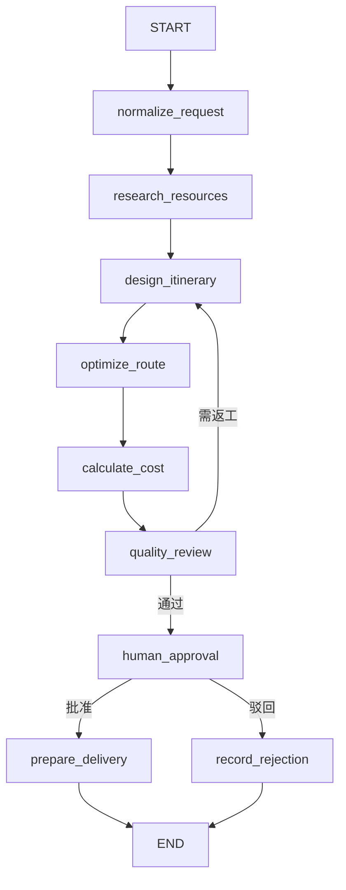

# 03｜多 Agent 与 LangGraph 工作流

## 1. 核心概念

本项目对几个容易混淆的概念做如下约定：

- Agent：对一个业务目标负责，能够读取状态、做判断并选择工具。
- Graph Node：LangGraph 中可执行的函数。一个 Agent 可以映射为一个或多个节点。
- Tool：具有明确参数和结果的确定性动作。
- Skill：某类任务的业务做法与约束，可被 Agent 复用。
- State：整个策划线程共享的结构化上下文。

项目避免让多个 Agent 无限制互相聊天，而是使用有向状态图建立可预测的执行顺序。

## 2. Agent 分工

| Agent | 主要职责 | 典型输入 | 典型输出 |
| --- | --- | --- | --- |
| 需求分析 Agent | 解析用户目标和约束 | 原始需求 | 标准化需求、缺失项 |
| 任务规划 Agent | 拆分策划任务 | 标准化需求 | 执行计划 |
| 资源研究 Agent | 检索候选资源 | 目的地、偏好 | 景点等候选项 |
| 行程设计 Agent | 组合每日活动 | 候选资源、天数 | 初版行程 |
| 路线优化 Agent | 减少折返并满足时间约束 | 初版行程、坐标 | 优化后行程 |
| 成本 Agent | 计算总成本和预算差异 | 行程、人数、预算 | 成本明细 |
| 质检 Agent | 检查事实、冲突和风险 | 完整方案 | 问题清单、结论 |
| 交付 Agent | 汇总客户可读内容 | 已批准方案 | 摘要、营销内容、海报任务 |

这些名称表达业务职责；具体代码可能将相邻职责合并为一个节点，以保持演示项目的可维护性。

## 3. 状态机



为避免死循环，返工路径需要累计尝试次数，并在超过阈值后转人工处理。

## 4. `PlanningState`

共享状态通常包含以下类别：

```python
class PlanningState(TypedDict, total=False):
    thread_id: str
    request: dict
    normalized_request: dict
    resources: list[dict]
    itinerary: list[dict]
    route_summary: dict
    cost_summary: dict
    quality_report: dict
    approval: dict
    delivery: dict
    errors: list[dict]
    retry_count: int
```

设计原则：

- 节点只写入自己负责的字段。
- 字段尽量是可校验的结构化对象，而不是大段自由文本。
- 原始输入与标准化结果同时保留，便于审计。
- 错误作为状态的一部分传递，使路由函数可以决定重试、降级或终止。

## 5. 条件边

条件边将业务决策从 Prompt 中抽离，例如：

- 质检通过：进入人工审批。
- 质检失败且可修复：回到行程设计或成本计算。
- 超过最大返工次数：升级给人工处理。
- 审批通过：生成交付物。
- 审批驳回：记录原因并结束，或根据策略进入修改流程。

路由函数应是确定性的 Python 逻辑，便于单元测试。

## 6. 人工审批的中断与恢复

LangGraph 的 `interrupt` 用于把当前状态暂停在审批关口：

1. 图执行到审批节点。
2. 节点返回包含方案摘要、预算和风险的审批载荷。
3. checkpoint 保存当前线程状态。
4. API 返回 `approval_required` 和 `thread_id`。
5. 审核人员提交决定。
6. API 使用 `Command(resume=...)` 恢复同一线程。

演示版本使用 `MemorySaver`，因此进程重启后状态会丢失。生产环境应改用持久化 checkpoint，并保证 `thread_id` 在租户内唯一。

## 7. 节点实现约束

一个合格节点应具备：

- 明确的输入字段和输出字段。
- 输入缺失时的错误信息。
- 对模型输出进行 Pydantic 校验。
- 对 Tool 调用设置超时和最大次数。
- 不在节点中直接隐藏高风险外部写入。
- 日志中包含 thread_id、node_name 和耗时。

示例结构：

```python
def calculate_cost_node(state: PlanningState) -> dict:
    result = tool_registry.invoke(
        "calculate_product_cost",
        itinerary=state["itinerary"],
        travelers=state["normalized_request"]["travelers"],
    )
    return {"cost_summary": result}
```

## 8. 重试与幂等

- 模型生成：可以重试，但每次应记录模型、Prompt 版本和失败原因。
- 查询工具：通常可安全重试。
- 计算工具：保证相同输入产生相同结果。
- 保存版本：使用 `plan_id + version` 或幂等键去重。
- 对外发布：默认禁止自动重试，必须确认上次执行结果。

## 9. 如何增加一个 Agent

1. 定义业务职责和不能做的事情。
2. 在 State 中增加最小必要字段。
3. 编写节点函数并注册允许使用的 Tools/Skills。
4. 为成功、失败和超时增加条件边。
5. 编写节点单测和图路径测试。
6. 在架构页和本文档中更新执行流程。

## 10. 当前实现边界

- ✅ 已有 LangGraph 图、共享状态、条件路由和审批恢复。
- ✅ 已有确定性的演示节点，便于无模型环境测试。
- 🟡 模型网关已经存在，但尚未全面替代演示节点逻辑。
- 🟡 checkpoint 当前为内存实现。
- ⬜ 多租户分布式执行、持久化 checkpoint 和节点级追踪属于生产化工作。

