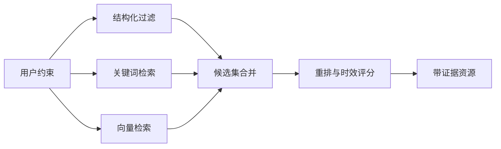

# 05｜数据模型与持久化

## 1. 数据层目标

TripOps AI 的数据层不仅保存最终行程，还要回答：

- 方案使用了哪些资源和证据？
- 审批前后发生了什么变化？
- 某条景点信息是否已经过期？
- 一个方案如何恢复到历史版本？

## 2. 核心 Pydantic 模型

业务实体定义在 `app/models/schemas.py`：

| 模型 | 作用 |
| --- | --- |
| `PlanRequest` | 策划任务输入（目的地、出发日期、天数、人数、预算、主题、节奏、约束） |
| `ProductType` / `TravelPace` / `PlanStatus` | 产品类型、旅行节奏、方案状态枚举 |
| `ResourceCandidate` | 候选资源，含来源 URL、检索时间、证据、坐标、评分 |
| `ItineraryDay` / `ItineraryEvent` | 分日行程与单个活动；活动费用由金额 + `cost_status` 共同表达 |
| `ConstraintReport` / `ConstraintIssue` | 约束校验结果 |
| `Quote` / `QuoteItem` | 成本明细、售价与毛利 |
| `QualityReport` | 多维度质量评分 |
| `PosterBrief` | 海报视觉 Brief |
| `ApprovalDecision` | 人工审批决定 |
| `PlanRunResponse` | REST 运行响应 |

LLM 结构化输出专用模型：

| 模型 | 用于节点 |
| --- | --- |
| `ResourceEnrichmentBatch` | retrieve_resources（资源充实，多模态） |
| `TravelTimeMatrix` / `TravelTimePair` | plan_itinerary（交通估算） |
| `ScheduleBatch` / `DailySchedule` / `ScheduledEvent` | plan_itinerary（行程编排） |
| `CostBreakdown` / `CostItemEstimate` | calculate_quote（LLM 成本估算，允许 0 作为待过滤的中间值） |
| `QualityAssessment` | quality_review |
| `PlannerConversation` | chat_graph / CLI 对话式需求收集 |

`Place` / `GeoPoint` / `DataWithSource`（`app/services/tools/base.py`）是工具层统一的数据溯源模型：每个动态字段（开放时间、价格、交通时间）携带来源、检索时间、置信度与是否估算标记。

## 3. 当前持久化：JSON 文件（默认）

`PlanStore`（`app/services/plan_store.py`）将方案版本和审批记录写入本地文件：

```text
data/plans/{plan_id}/
  ├── v1.0.json        # 方案快照（不可变）
  ├── v2.0.json        # 新版本
  ├── approval.json    # 审批记录
  ├── report.md        # 不嵌图的详细执行报告（需求、逐日时间表、费用口径、天气、校验与来源）
  ├── report.pdf       # 带封面和每日配图的精简横版矢量 PDF（简介行程 + 报价/天气摘要）
  └── poster-*.png     # 封面海报 + 分日插图（每天 1-3 张）
```

- 版本号自增，快照不可原地修改。
- 审批记录与方案版本分开保存。
- 无需数据库即可运行，适合命令行演示。

## 4. 费用数据语义

`ItineraryEvent.cost_per_person=0` 不再等价于“价格为 0 元”。`cost_status` 将零值区分为：

- `free`：当前信息显示免费，但出发前仍需确认。
- `included`：已在团队报价中统一核算。
- `optional`：购物、茶饮等按需自理。
- `unknown`：暂无可靠单项报价，待确认。

最终 `QuoteItem.amount` 必须大于 0。LLM 的 `CostItemEstimate` 可返回 0 作为中间结果，节点会过滤这些项；若全部为 0，则生成非零的保守成本明细，避免总成本错误为 0 或触发 Pydantic 校验异常。

## 5. 混合检索方案

生产级资源检索建议采用：



当前实现：

- ✅ Tavily MCP 实时网页检索 + 高德 POI 结构化检索（双路合并、去重）。
- ⬜ 向量检索与嵌入模型尚未接入（规划中）。

## 6. 证据与时效性

每个会影响客户决策的事实应尽量携带：

- `source_url` 或数据供应商。
- `retrieved_at`。
- `provider`（如 `tavily_mcp` / `amap` / `llm_estimate`）。
- 原始摘要片段。

开放时间、票价和交通政策属于高时效信息。当前由 LLM 估算并标记"需在官方渠道二次确认"，而不是让模型直接编造确定值。

## 7. RAG 防护（已实现）

外部网页文本应被视为不可信数据。`app/services/guard.py` 在检索节点实时执行：

- 正则模式检测 Prompt Injection：系统指令覆盖、角色劫持、工具调用注入、输出格式操纵、数据外泄、DoS 循环等。
- `filter_resources` 过滤含注入模式的资源，并校验来源 URL 域名（白名单/黑名单）。
- 检索内容不覆盖系统指令；事实证据与操作指令分离。
- 关键报价在最终交付前经过确定性校验（`verifier`）与人工确认。

## 8. 一致性与版本

- 一个审批记录对应一个方案。
- 版本快照不可原地修改。
- 成本计算使用的价格快照与方案版本一起保存。
- 重新生成交付物不覆盖历史资产。
- 行程必须包含且只包含 `1..request.days` 的连续天序号；该不变量由约束节点与 verifier 双重校验。
- 图片数组必须与行程天数一一对应，缺少任意一天的图片不会进入审批。

## 9. 当前实现边界

- ✅ JSON 文件持久化（方案版本 + 审批记录 + 报告/PDF/海报）。
- ✅ 完整的 Pydantic 业务模型与 LLM 结构化输出模型。
- ✅ Prompt Injection 防护与来源校验。
- ✅ 费用零值语义归一化、非零报价兜底、天数完整性双重校验。
- ⬜ 混合检索调优、供应商同步与数据治理尚未实现。
