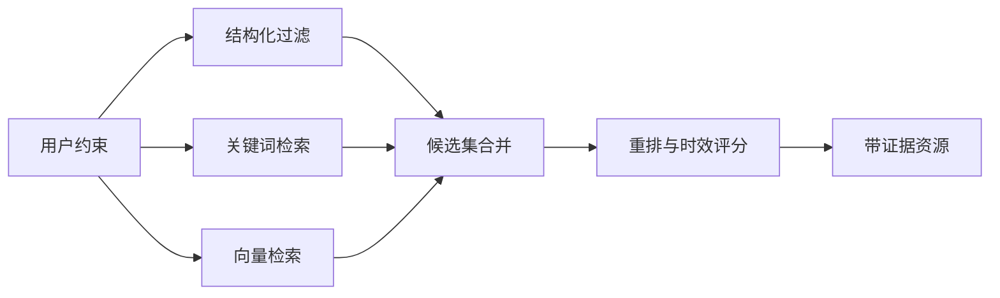

# 05｜数据模型与持久化

## 1. 数据层目标

TripOps AI 的数据层不仅保存最终行程，还要回答：

- 方案使用了哪些资源和证据？
- 审批前后发生了什么变化？
- 某条景点信息是否已经过期？
- 一个方案如何恢复到历史版本？

## 2. 核心 Pydantic 模型

业务实体定义在 `app/models/schemas.py`：

| 模型 | 作用 |
| --- | --- |
| `PlanRequest` | 策划任务输入（目的地、天数、人数、预算、主题、节奏、约束） |
| `ProductType` / `TravelPace` / `PlanStatus` | 产品类型、旅行节奏、方案状态枚举 |
| `ResourceCandidate` | 候选资源，含来源 URL、检索时间、证据、坐标、评分 |
| `ItineraryDay` / `ItineraryEvent` | 分日行程与单个活动 |
| `ConstraintReport` / `ConstraintIssue` | 约束校验结果 |
| `Quote` / `QuoteItem` | 成本明细、售价与毛利 |
| `QualityReport` | 多维度质量评分 |
| `PosterBrief` | 海报视觉 Brief |
| `ApprovalDecision` | 人工审批决定 |
| `PlanRunResponse` | REST 运行响应 |
| `ToolSummary` | 工具元数据（API `/tools`） |

LLM 结构化输出专用模型：

| 模型 | 用于节点 |
| --- | --- |
| `RequirementAnalysis` | parse_requirements |
| `ResourceEnrichmentBatch` | retrieve_resources（资源充实，多模态） |
| `TravelTimeMatrix` / `TravelTimePair` | plan_itinerary（交通估算） |
| `ScheduleBatch` / `DailySchedule` / `ScheduledEvent` | plan_itinerary（行程编排） |
| `CostBreakdown` / `CostItemEstimate` | calculate_quote（成本估算） |
| `QualityAssessment` | quality_review |
| `PlannerConversation` | chat_graph / CLI 对话式需求收集 |

`Place` / `GeoPoint` / `DataWithSource`（`app/services/tools/base.py`）是工具层统一的数据溯源模型：每个动态字段（开放时间、价格、交通时间）携带来源、检索时间、置信度与是否估算标记。

## 3. 当前持久化：JSON 文件（默认）

`PlanStore`（`app/services/plan_store.py`）将方案版本和审批记录写入本地文件：

```text
data/plans/{plan_id}/
  ├── v1.0.json        # 方案快照（不可变）
  ├── v2.0.json        # 新版本
  ├── approval.json    # 审批记录
  ├── report.md        # Markdown 交付报告
  ├── report.pdf       # PDF 交付物（Pillow 合成）
  └── poster-*.png     # 海报 / 分日插图素材
```

- 版本号自增，快照不可原地修改。
- 审批记录与方案版本分开保存。
- 无需数据库即可运行，适合命令行演示。

用户偏好记忆由 `ProfileStore`（`app/services/profile.py`）保存到 `data/profiles/{user_id}.json`，敏感数据（护照、支付信息）不存储。

## 4. 可选持久化：PostgreSQL（asyncpg 适配器）

`app/services/db.py` 提供异步连接池适配，配置 `DATABASE_URL` 后自动启用，未配置时静默回退文件存储：

| 函数 | 作用 |
| --- | --- |
| `save_plan_version` | 写入 `plan_versions` 表（版本快照） |
| `save_plan_record` | 写入 / 更新 `plans` 表（方案状态） |
| `log_agent_run` | 写入 `agent_runs` 表（节点运行记录） |
| `log_tool_invocation` | 写入 `tool_invocations` 表（工具调用耗时/状态） |
| `search_resources_by_embedding` | pgvector 向量相似度检索 |

`infra/postgres/init.sql` 定义核心表：

| 表 | 作用 |
| --- | --- |
| `travel_resources` | 文旅资源、地理坐标（PostGIS）与语义向量（pgvector 1024 维） |
| `plans` | 策划任务及当前状态 |
| `plan_versions` | 每次方案快照 |
| `agent_runs` | Agent/节点运行记录 |
| `tool_invocations` | 工具调用、耗时和结果状态 |

### 为什么使用 PostGIS

文旅规划需要空间可行性。PostGIS 可处理：

- 查询某坐标半径内的资源。
- 计算两个景点的直线距离。
- 按行政区或地理围栏过滤。

直线距离不等于真实驾驶时间，因此生产环境还需要地图路线服务。当前项目用高德真实路径 + LLM 估算交通时间，PostGIS 更适合作为空间过滤与粗排层。

### 为什么使用 pgvector

用户偏好常以自然语言表达，例如"适合老人、不要太商业化"。关键词检索难以完整匹配，向量检索可以召回语义相近的资源。

## 5. 混合检索方案

生产级资源检索建议采用：



当前实现：

- ✅ Tavily MCP 实时网页检索 + 高德 POI 结构化检索（双路合并、去重）。
- ✅ `search_resources_by_embedding`（pgvector 相似度检索）已实现。
- ⬜ 向量检索尚未接入 `retrieve_resources` 节点，嵌入模型（Ollama）为规划中配置。

## 6. 证据与时效性

每个会影响客户决策的事实应尽量携带：

- `source_url` 或数据供应商。
- `retrieved_at`。
- `provider`（如 `tavily_mcp` / `amap` / `llm_estimate`）。
- 原始摘要片段。

开放时间、票价和交通政策属于高时效信息。当前由 LLM 估算并标记"需在官方渠道二次确认"，而不是让模型直接编造确定值。

## 7. RAG 防护（已实现）

外部网页文本应被视为不可信数据。`app/services/guard.py` 在检索节点实时执行：

- 正则模式检测 Prompt Injection：系统指令覆盖、角色劫持、工具调用注入、输出格式操纵、数据外泄、DoS 循环等。
- `filter_resources` 过滤含注入模式的资源，并校验来源 URL 域名（白名单/黑名单）。
- `safe_truncate` 在截断边界避免触发模式。
- 检索内容不覆盖系统指令；事实证据与操作指令分离。
- 关键报价在最终交付前经过确定性校验（`verifier`）与人工确认。

## 8. 一致性与版本

- 一个审批记录对应一个方案。
- 版本快照不可原地修改。
- 成本计算使用的价格快照与方案版本一起保存。
- 重新生成交付物不覆盖历史资产。

## 9. 当前实现边界

- ✅ JSON 文件持久化（方案版本 + 审批记录 + 报告/PDF/海报）。
- ✅ PostgreSQL asyncpg 适配器（版本、计划、运行记录、工具调用、向量检索）。
- ✅ 完整的 Pydantic 业务模型与 LLM 结构化输出模型。
- ✅ Prompt Injection 防护与来源校验。
- ✅ 用户偏好 ProfileStore。
- 🟡 pgvector 检索已实现但未接入主检索链路。
- ⬜ 混合检索调优、供应商同步与数据治理尚未实现。
