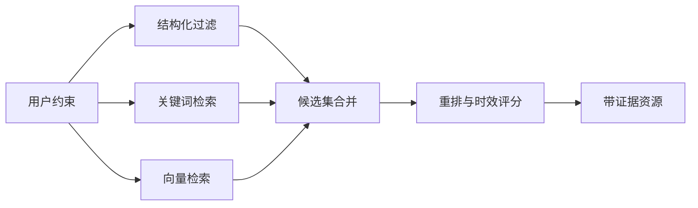

# 05｜数据模型与 RAG

## 1. 数据层目标

TripOps AI 的数据层不仅保存最终行程，还要回答：

- 方案使用了哪些资源和证据？
- 哪个 Agent、模型和工具修改了某个字段？
- 审批前后发生了什么变化？
- 某条景点信息是否已经过期？
- 一个方案如何恢复到历史版本？

## 2. 当前核心表

初始化脚本定义了以下核心实体：

| 表 | 作用 |
| --- | --- |
| `travel_resources` | 保存景点等文旅资源、地理位置与向量 |
| `plans` | 保存策划任务及当前状态 |
| `plan_versions` | 保存每次方案快照 |
| `agent_runs` | 保存 Agent/节点运行记录 |
| `tool_invocations` | 保存工具调用、耗时和结果状态 |

### `travel_resources`

关键字段建议包括：

- 资源类型、名称、目的地和标签。
- `GEOGRAPHY(Point, 4326)` 地理坐标。
- 开放时间、参考价格和来源。
- `embedding vector(1024)` 语义向量。
- 数据抓取时间和有效期。

### `plans` 与 `plan_versions`

`plans` 保存当前业务状态，`plan_versions` 保存不可变快照。审批应绑定明确版本，避免审核过程中方案被悄悄修改。

### 审计表

`agent_runs` 和 `tool_invocations` 用来还原执行过程。生产环境还应增加：

- prompt_version
- model_name / model_digest
- input_hash / output_hash
- token_usage
- error_code
- tenant_id / operator_id

## 3. 为什么使用 PostGIS

文旅规划同时需要语义相关性和空间可行性。PostGIS 可处理：

- 查询某坐标半径内的资源。
- 计算两个景点的直线距离。
- 按行政区或地理围栏过滤。
- 为路线优化提供候选集预筛选。

直线距离不等于真实驾驶时间，因此生产环境还需要地图路线服务。PostGIS 更适合作为空间过滤与粗排层。

## 4. 为什么使用 pgvector

用户偏好常以自然语言表达，例如“适合老人、不要太商业化、有川西人文感”。关键词检索难以完整匹配，向量检索可以召回语义相近的资源。

当前 Schema 使用 1024 维向量，应保证嵌入模型输出维度一致。更换嵌入模型时需要新列或重建索引，不能直接混用。

## 5. 混合检索方案

生产级资源检索建议采用：



综合得分可由以下因素构成：

```text
score =
  语义相关度 × 0.35 +
  关键词匹配 × 0.20 +
  距离便利度 × 0.15 +
  人群适配度 × 0.15 +
  数据新鲜度 × 0.15
```

权重只是起点，应通过历史选择和人工评审数据校准。

## 6. 证据与时效性

每个会影响客户决策的事实应尽量携带：

- `source_url` 或数据供应商。
- `retrieved_at`。
- `valid_until`（如适用）。
- `confidence`。
- 原始片段或结构化字段。

开放时间、票价和交通政策属于高时效信息。若数据超过阈值，应在方案中提示“交付前需二次确认”，而不是让模型补全。

## 7. RAG 防护

外部网页或供应商文本应被视为不可信数据：

- 检索内容不能覆盖系统指令。
- 丢弃要求模型执行动作的页面文本。
- 工具层对 URL、大小和内容类型做限制。
- 将事实证据与操作指令分离。
- 关键报价至少进行一次规则校验或人工确认。

## 8. 一致性与版本

- 一个审批记录只指向一个 `plan_version_id`。
- 版本快照不可原地修改。
- 成本计算使用的价格快照与方案版本一起保存。
- 海报和营销文案记录来源方案版本。
- 重新生成交付物不覆盖历史资产。

## 9. 当前实现边界

- ✅ 数据库初始化脚本包含 PostGIS、pgvector 和核心业务表。
- ✅ 应用层已经定义方案状态和版本化工具接口。
- 🟡 默认演示流程使用内存资源，不要求数据库即可运行。
- ⬜ 混合检索、索引调优、供应商同步与数据治理尚未完整实现。

