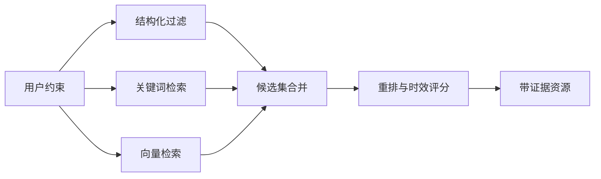

# 05｜数据模型与持久化

## 1. 数据层目标

TripOps AI 的数据层不仅保存最终行程，还要回答：

- 方案使用了哪些资源和证据？
- 审批前后发生了什么变化？
- 某条景点信息是否已经过期？
- 一个方案如何恢复到历史版本？

## 2. 核心 Pydantic 模型

业务实体定义在 `app/models/schemas.py`：

| 模型 | 作用 |
| --- | --- |
| `PlanRequest` | 策划任务输入（目的地、天数、人数、预算、主题、约束） |
| `ResourceCandidate` | 候选资源，含来源 URL、检索时间、证据 |
| `ItineraryDay` / `ItineraryEvent` | 分日行程与单个活动 |
| `ConstraintReport` / `ConstraintIssue` | 约束校验结果 |
| `Quote` / `QuoteItem` | 成本明细、售价与毛利 |
| `QualityReport` | 多维度质量评分 |
| `PosterBrief` | 海报视觉 Brief |
| `ApprovalDecision` | 人工审批决定 |

LLM 结构化输出专用模型：

| 模型 | 用于节点 |
| --- | --- |
| `RequirementAnalysis` | parse_requirements |
| `ResourceEnrichmentBatch` | retrieve_resources（资源充实） |
| `TravelTimeMatrix` | plan_itinerary（交通估算） |
| `ScheduleBatch` | plan_itinerary（行程编排） |
| `CostBreakdown` | calculate_quote（成本估算） |
| `QualityAssessment` | quality_review |
| `PlannerConversation` | CLI 对话式需求收集 |

## 3. 当前持久化：JSON 文件

`PlanStore`（`app/services/plan_store.py`）将方案版本和审批记录写入本地文件：

```text
data/plans/{plan_id}/
  ├── v1.0.json        # 方案快照（不可变）
  ├── v2.0.json        # 新版本
  └── approval.json    # 审批记录
```

- 版本号自增，快照不可原地修改。
- 审批记录与方案版本分开保存。
- 无需数据库即可运行，适合命令行演示。

## 4. 规划持久化：PostgreSQL + PostGIS + pgvector

`infra/postgres/init.sql` 已提供初始化脚本，定义以下核心表：

| 表 | 作用 |
| --- | --- |
| `travel_resources` | 文旅资源、地理坐标与语义向量 |
| `plans` | 策划任务及当前状态 |
| `plan_versions` | 每次方案快照 |
| `agent_runs` | Agent/节点运行记录 |
| `tool_invocations` | 工具调用、耗时和结果状态 |

### 为什么使用 PostGIS

文旅规划需要空间可行性。PostGIS 可处理：

- 查询某坐标半径内的资源。
- 计算两个景点的直线距离。
- 按行政区或地理围栏过滤。

直线距离不等于真实驾驶时间，因此生产环境还需要地图路线服务。当前项目用 LLM 估算交通时间，PostGIS 更适合作为空间过滤与粗排层。

### 为什么使用 pgvector

用户偏好常以自然语言表达，例如"适合老人、不要太商业化"。关键词检索难以完整匹配，向量检索可以召回语义相近的资源。

初始化脚本使用 1024 维向量（`embedding vector(1024)`），更换嵌入模型时需要新列或重建索引。

## 5. 混合检索方案（规划）

生产级资源检索建议采用：



当前项目通过 Tavily MCP 做实时网页检索，尚未接入向量混合检索。

## 6. 证据与时效性

每个会影响客户决策的事实应尽量携带：

- `source_url` 或数据供应商。
- `retrieved_at`。
- `provider`（如 `tavily_mcp`）。
- 原始摘要片段。

开放时间、票价和交通政策属于高时效信息。当前由 LLM 估算并标记"需在官方渠道二次确认"，而不是让模型直接编造确定值。

## 7. RAG 防护

外部网页文本应被视为不可信数据：

- 检索内容不能覆盖系统指令。
- 丢弃要求模型执行动作的页面文本。
- 工具层对 URL 和内容大小做限制（`include_raw_content=false`）。
- 将事实证据与操作指令分离。
- 关键报价至少进行一次规则校验或人工确认。

## 8. 一致性与版本

- 一个审批记录对应一个方案。
- 版本快照不可原地修改。
- 成本计算使用的价格快照与方案版本一起保存。
- 重新生成交付物不覆盖历史资产。

## 9. 当前实现边界

- ✅ JSON 文件持久化（方案版本 + 审批记录）。
- ✅ 完整的 Pydantic 业务模型与 LLM 结构化输出模型。
- ✅ PostgreSQL/PostGIS/pgvector 初始化脚本。
- ⬜ 混合检索、索引调优、供应商同步与数据治理尚未实现。
