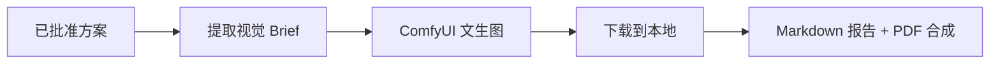

# 06｜模型接入与提示词策略

## 1. 模型资源

项目使用火山引擎 Ark（OpenAI-compatible API）的多模型分层策略，按任务难度路由：

| 配置项 | 默认值 | 接入方式 | 职责 |
| --- | --- | --- | --- |
| `LLM_MODEL` | `ark-code-latest` | 火山引擎 Ark | 默认模型 |
| `LLM_MODEL_COMPLEX` | `DeepSeek-V4-Pro` | 火山引擎 Ark | 资源充实、交通估算、行程编排、成本核算、质量审核 |
| `LLM_MODEL_SIMPLE` | `Doubao-Seed-2.0-lite` | 火山引擎 Ark | 对话式需求收集（chat_graph / `/chat`） |
| `LLM_MODEL_MULTIMODAL` | `Doubao-Seed-2.1-turbo` | 火山引擎 Ark | 资源充实（携带图片分析）、CLI 对话 |

模型按复杂度分层：复杂推理用 DeepSeek-V4-Pro，快速对话用 Doubao lite，多模态任务用 Doubao turbo。`ModelGateway.structured_completion` 通过 `model` 参数覆盖默认值。

文生图由 ComfyUI 适配器负责（`PosterService`），可通过 `MOCK_IMAGEGEN` 在预处理素材与真实端点之间切换。

## 2. 当前接入状态

- ✅ 统一 `ModelGateway` 适配层（`app/services/model_gateway.py`）。
- ✅ 多模型分层路由 + 多模态输入（`image_urls`，最多 10 张）。
- ✅ 所有 LLM 节点真实调用 Ark API，无演示逻辑。
- ✅ 结构化输出 + Pydantic 校验。
- ✅ 海报服务支持 Mock/真实端点切换。
- ⬜ 模型回退、配额、缓存和线上评估仍需补充。

## 3. ModelGateway 设计

```python
gateway = ModelGateway(settings)
result = await gateway.structured_completion(
    model=settings.llm_model_complex,   # 可选，覆盖默认模型
    system_prompt=COST_ESTIMATION_SYSTEM,
    user_prompt="...",
    schema=CostBreakdown,
    timeout_seconds=45,
    image_urls=[...],                    # 可选，多模态
)
```

关键实现：

- 请求体携带 `response_format: {"type": "json_object"}` 强制 JSON 输出。
- 携带 `thinking: {"type": "disabled"}` 禁用思考模式，降低延迟。
- `_schema_hint(schema)` 把 Pydantic 字段描述注入 system prompt，而不是 dump 完整 JSON Schema。
- 多模态时把 `user_prompt` 与图片 URL 组装成 OpenAI 消息数组。
- 输出用 `schema.model_validate_json` 校验，失败抛出异常由节点降级处理。

## 4. Prompt 分层

每个 system prompt 分为四层：

1. 系统约束：角色、安全边界、不可编造规则。
2. 任务说明：本节点要完成的具体工作。
3. 状态上下文：经过筛选的需求、资源和历史结果（由 user prompt 注入）。
4. 输出 Schema：字段、类型与默认值（由 `_schema_hint` 自动注入）。

所有 prompt 定义在 `app/agents/prompts.py`：

| Prompt | 节点 / 用途 |
| --- | --- |
| `PARSE_USER_INPUT_SYSTEM` | chat_graph / CLI 对话式需求收集 |
| `RESOURCE_ENRICHMENT_SYSTEM` | retrieve_resources（多模态资源充实） |
| `TRAVEL_TIME_SYSTEM` | plan_itinerary（交通估算） |
| `SCHEDULE_SYSTEM` | plan_itinerary（行程编排，结合天气安排室内/户外） |
| `COST_ESTIMATION_SYSTEM` | calculate_quote |
| `QUALITY_REVIEW_SYSTEM` | quality_review |

## 5. 结构化输出与降级

涉及后续计算的数据必须使用 Pydantic 校验。校验失败的处理因节点而异：

| 节点 | 失败降级 |
| --- | --- |
| retrieve_resources | 跳过充实，保留原始搜索结果 |
| plan_itinerary | 降级到基础时间表布局 |
| calculate_quote | 抛出异常（无 LLM 无法核算；Mock 模式下同样抛错） |
| quality_review | 抛出异常（无 LLM 无法审核；Mock 模式下同样抛错） |
| review_repair | 确定性重排（不调用 LLM） |

降级只发生在有确定性兜底的节点；核心核算与审核不允许静默补默认值。

## 6. 事实与创意分离

- 景点来源：必须来自 Tavily MCP / 高德 POI 检索，带来源与检索时间。
- 票价、时长、交通时间：由 LLM 估算或高德实测并标记待确认，不由代码硬编码。
- 成本总计与售价：使用代码计算（`calculate_product_cost`），不让模型做最终算术。
- 行程节奏、主题和描述：可由模型生成。
- 硬性约束：由确定性规则引擎（validate_constraints + verifier）检查。

这能降低幻觉对实际报价的影响。

## 7. 海报生成流程

文生图只在方案通过审核并进入交付阶段后调用：



- `PosterService` 从 `workflow_template.json` 构建 ComfyUI 工作流，提交 `/prompt`，轮询 `/history/{prompt_id}` 获取结果，再下载到 `data/plans/{plan_id}/`。
- 真实模式生成 1 张封面 + 每天 1-3 张分日插图（按当天活动丰富度智能决定）；`MOCK_IMAGEGEN=true` 时直接返回预处理素材，不调用真实端点。
- 分日图片失败不影响主流程（`asyncio.gather(return_exceptions=True)` 容错）。
- 视觉 Brief 包含目的地、主题、客群、色彩、构图元素和禁止项（文字、水印等）。

## 8. 配置

```env
LLM_BASE_URL=https://ark.cn-beijing.volces.com/api/coding/v3
LLM_API_KEY=<your-key>
LLM_MODEL=ark-code-latest

LLM_MODEL_COMPLEX=DeepSeek-V4-Pro
LLM_MODEL_SIMPLE=Doubao-Seed-2.0-lite
LLM_MODEL_MULTIMODAL=Doubao-Seed-2.1-turbo

MOCK_IMAGEGEN=true
IMAGEGEN_API_URL=http://127.0.0.1:8188
```

密钥只能通过环境变量或 `.env` 提供（`.env` 已加入 `.gitignore`），不应写入仓库。

## 9. Prompt 版本与评估

质量评估框架（`app/services/evaluation.py`）已实现：从可执行性（40%）、个性化（35%）、信息质量（25%）三个维度对完整方案打分，`scripts/e2e_full_run.py` 会在真实全流程后输出评估结果。

每次 Prompt 更新建议记录：版本号和修改原因、结构化输出成功率、业务规则通过率、平均延迟与 Token 消耗。当前尚未接入自动化评估平台，属于后续工作。
