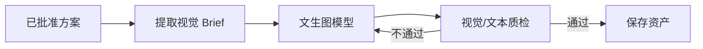

# 06｜模型接入与提示词策略

## 1. 模型资源

项目面向以下本地模型组合：

| 模型 | 建议职责 | 原因 |
| --- | --- | --- |
| `qwen3:4b` | 分类、抽取、改写、格式修复、轻量质检 | 延迟低，适合高频节点 |
| `qwen3:8b` | 复杂行程设计、约束权衡、综合总结 | 推理和长文本能力更强 |
| `qwen3-vl:4b` | 图片理解、菜单/景点图审核、海报视觉质检 | 可处理视觉输入 |
| 文生图模型 | 审批后生成目的地宣传海报 | 只在最终交付阶段产生视觉资产 |

模型路由的关键不是“每个 Agent 一个模型”，而是根据任务难度、输入模态、时延和失败成本选择模型。

## 2. 当前接入状态

- ✅ 后端提供统一 `ModelGateway` 适配层。
- ✅ 配置支持 Ollama 地址和模型名称。
- 🟡 主工作流默认使用确定性演示逻辑，保证无模型环境也可测试。
- 🟡 海报服务支持 Mock/真实端点切换，默认返回演示资产。
- ⬜ 完整的模型回退、配额、缓存和线上评估仍需补充。

这意味着项目展示的是可扩展架构，不应在简历中表述为“所有 Agent 已完全由四个真实模型在线驱动”。

## 3. 模型路由策略

示例路由：

```python
def select_model(task):
    if task.requires_vision:
        return "qwen3-vl:4b"
    if task.complexity == "high":
        return "qwen3:8b"
    return "qwen3:4b"
```

还应考虑：

- Prompt 长度是否超过模型适用窗口。
- 节点是否有严格 JSON 输出要求。
- 当前模型服务负载。
- 任务预算和最大延迟。
- 上一次失败属于格式问题还是推理问题。

格式问题可以先让 4B 修复；复杂规划失败再升级到 8B。

## 4. Prompt 分层

建议将 Prompt 分为四层：

1. 系统约束：角色、安全边界、不可编造规则。
2. Skill 指令：本次任务采用的业务方法。
3. 状态上下文：经过筛选的用户需求、资源和历史结果。
4. 输出 Schema：字段、枚举、长度与示例。

不要把数据库原始记录、所有技能和全部历史消息一次性塞进上下文。

## 5. 结构化输出

涉及后续计算的数据必须使用 JSON Schema/Pydantic 校验，例如：

```json
{
  "day": 1,
  "items": [
    {
      "resource_id": "poi_001",
      "start_time": "09:00",
      "duration_minutes": 120,
      "reason": "符合文化体验偏好"
    }
  ]
}
```

校验失败处理：

1. 将具体校验错误反馈给同一模型做一次格式修复。
2. 仍失败则使用更强模型重试。
3. 超过次数上限后返回可定位的节点错误，不静默补默认值。

## 6. 事实与创意分离

- 景点价格、开放时间和距离：必须来自 Tool。
- 行程节奏、产品主题和卖点组织：可由模型生成。
- 成本总计：使用代码计算，不让模型做最终算术。
- 风险结论：模型可发现问题，规则引擎负责硬性检查。

这能降低幻觉对实际报价的影响。

## 7. 海报生成流程

文生图只在方案批准后调用：



视觉 Brief 建议包含：

- 目的地和季节。
- 目标客群和情绪。
- 核心地标、色彩与构图。
- 海报比例和留白区域。
- 禁止生成的商标、错误文字或敏感内容。

中文标题最好由前端排版叠加，避免图像模型生成不可读文字。

## 8. 海报服务配置

Mock 模式适合开发与测试：

```env
POSTER_PROVIDER=mock
```

真实模式需要配置具体文生图端点和密钥，适配器应统一返回：

```json
{
  "status": "succeeded",
  "asset_url": "...",
  "prompt_version": "poster-v1",
  "seed": 12345
}
```

密钥只能通过环境变量或密钥管理服务提供，不应写入仓库。

## 9. Prompt 版本与评估

每次 Prompt 更新至少记录：

- 版本号和修改原因。
- 使用模型和采样参数。
- 结构化输出成功率。
- 业务规则通过率。
- 人工偏好评分。
- 平均延迟与 Token 消耗。

只有离线评估和关键路径回归都通过后，才替换默认版本。

