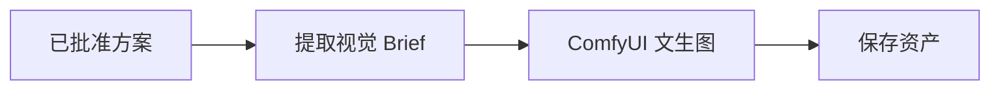

# 06｜模型接入与提示词策略

## 1. 模型资源

项目使用单一云端模型完成所有 LLM 节点：

| 模型 | 接入方式 | 职责 |
| --- | --- | --- |
| `ark-code-latest` | 火山引擎 Ark（OpenAI-compatible） | 需求解析、资源充实、交通估算、行程编排、成本估算、质量审核、对话式需求收集 |

选择单一模型简化了路由和部署。任务难度差异通过 Prompt 和结构化输出约束来消化，而不是切换模型。后续如需按任务分级，可在 `ModelGateway.structured_completion` 中传入 `model` 参数覆盖默认值。

文生图由 ComfyUI 适配器负责（`PosterService`），当前默认 `MOCK_IMAGEGEN=true` 返回预处理素材。

## 2. 当前接入状态

- ✅ 统一 `ModelGateway` 适配层（`app/services/model_gateway.py`）。
- ✅ 所有 LLM 节点真实调用 Ark API，无演示逻辑。
- ✅ 结构化输出 + Pydantic 校验。
- ✅ 海报服务支持 Mock/真实端点切换。
- ⬜ 模型回退、配额、缓存和线上评估仍需补充。

## 3. ModelGateway 设计

```python
gateway = ModelGateway(settings)
result = await gateway.structured_completion(
    system_prompt=COST_ESTIMATION_SYSTEM,
    user_prompt="...",
    schema=CostBreakdown,
    timeout_seconds=45,
)
```

关键实现：

- 请求体携带 `response_format: {"type": "json_object"}` 强制 JSON 输出。
- 携带 `thinking: {"type": "disabled"}` 禁用思考模式，降低延迟。
- `_schema_hint(schema)` 把 Pydantic 字段描述注入 system prompt，而不是 dump 完整 JSON Schema。
- `_extract_json` 剥离模型可能包裹的 markdown 代码块或思考文本。
- 输出用 `schema.model_validate_json` 校验，失败抛出异常由节点降级处理。

## 4. Prompt 分层

每个 system prompt 分为四层：

1. 系统约束：角色、安全边界、不可编造规则。
2. 任务说明：本节点要完成的具体工作。
3. 状态上下文：经过筛选的需求、资源和历史结果（由 user prompt 注入）。
4. 输出 Schema：字段、类型与默认值（由 `_schema_hint` 自动注入）。

所有 prompt 定义在 `app/agents/prompts.py`：

| Prompt | 节点 |
| --- | --- |
| `PARSE_USER_INPUT_SYSTEM` | CLI 对话式需求收集 |
| `REQUIREMENT_ANALYSIS_SYSTEM` | parse_requirements |
| `RESOURCE_ENRICHMENT_SYSTEM` | retrieve_resources |
| `TRAVEL_TIME_SYSTEM` | plan_itinerary（交通估算） |
| `SCHEDULE_SYSTEM` | plan_itinerary（行程编排） |
| `COST_ESTIMATION_SYSTEM` | calculate_quote |
| `QUALITY_REVIEW_SYSTEM` | quality_review |

## 5. 结构化输出与降级

涉及后续计算的数据必须使用 Pydantic 校验。校验失败的处理因节点而异：

| 节点 | 失败降级 |
| --- | --- |
| parse_requirements | 降级到默认值（requirements_complete=true） |
| retrieve_resources | 跳过充实，保留原始搜索结果 |
| plan_itinerary | 降级到基础时间表布局 |
| calculate_quote | 抛出异常（无 LLM 无法核算） |
| quality_review | 抛出异常（无 LLM 无法审核） |

降级只发生在有确定性兜底的节点；核心核算与审核不允许静默补默认值。

## 6. 事实与创意分离

- 景点来源：必须来自 Tavily MCP 搜索，带 URL 和检索时间。
- 票价、时长、交通时间：由 LLM 估算并标记待确认，不由代码硬编码。
- 成本总计与售价：使用代码计算（`calculate_product_cost`），不让模型做最终算术。
- 行程节奏、主题和描述：可由模型生成。
- 硬性约束：由确定性规则引擎（validate_constraints）检查。

这能降低幻觉对实际报价的影响。

## 7. 海报生成流程

文生图只在方案批准后调用：



`PosterService` 从 `workflow_template.json` 构建 ComfyUI 工作流，提交到 `/prompt`，然后轮询 `/history/{prompt_id}` 获取结果。`MOCK_IMAGEGEN=true` 时直接返回预处理素材，不调用真实端点。

视觉 Brief 包含目的地、主题、客群、色彩、构图元素和禁止项（文字、水印等）。中文标题最好由前端排版叠加，避免图像模型生成不可读文字。

## 8. 配置

```env
LLM_BASE_URL=https://ark.cn-beijing.volces.com/api/coding/v3
LLM_API_KEY=<your-key>
LLM_MODEL=ark-code-latest

MOCK_IMAGEGEN=true
IMAGEGEN_API_URL=http://127.0.0.1:8188
```

密钥只能通过环境变量或 `.env` 提供（`.env` 已加入 `.gitignore`），不应写入仓库。

## 9. Prompt 版本与评估（规划）

每次 Prompt 更新建议记录：

- 版本号和修改原因。
- 结构化输出成功率。
- 业务规则通过率。
- 平均延迟与 Token 消耗。

当前尚未接入自动化评估平台，属于后续工作。
