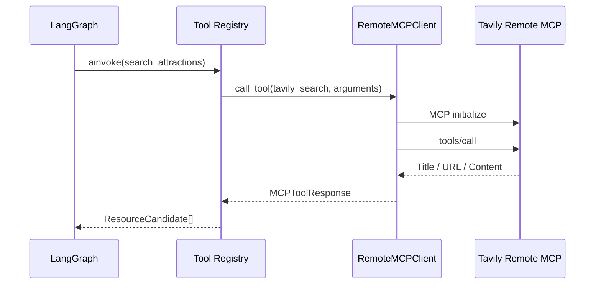

# 11｜Tavily MCP 真实搜索

## 1. 目标

资源研究节点需要根据目的地、产品主题和目标人群获得当前网页信息，同时保留来源和检索时间。项目使用 Tavily Remote MCP，而不是直接调用 Tavily REST SDK，使搜索能力以标准 MCP Tool 的形式接入。

## 2. 调用链



## 3. 传输与鉴权

- Transport：MCP Streamable HTTP。
- Server：`https://mcp.tavily.com/mcp`。
- Tool：`tavily_search`。
- 鉴权：`Authorization: Bearer <TAVILY_API_KEY>`。
- SDK：官方 `mcp` Python SDK 1.x 稳定版本。

API Key 不拼接到 URL，不写入异常消息，也不会由健康检查返回。

## 4. 搜索参数

系统将业务参数组合为检索问题：

```text
成都 旅游景点 活动 官方信息 开放时间 门票 地址；
主题：人文、美食；适合人群：亲子家庭
```

调用参数：

```json
{
  "query": "...",
  "topic": "general",
  "search_depth": "advanced",
  "max_results": 8,
  "include_images": false,
  "include_raw_content": false
}
```

限制原始正文可以降低上下文体积和 Prompt Injection 风险。需要核对特定页面时，再单独增加 `tavily_extract` Tool。

## 5. 结果转换

Tavily MCP 的搜索结果被转换为统一 `ResourceCandidate`：

```json
{
  "id": "web-3a35f...",
  "name": "成都武侯祠官方参观指南",
  "category": "web_resource",
  "location": "成都",
  "opening_hours": "需在官方渠道二次确认",
  "evidence": "Tavily MCP / https://... / 2026-07-30",
  "source_url": "https://...",
  "source_title": "成都武侯祠官方参观指南",
  "retrieved_at": "2026-07-30T10:00:00Z",
  "provider": "tavily_mcp",
  "summary": "搜索摘要……"
}
```

网页摘要不能被直接当成最终票价或库存。`opening_hours` 和价格等高时效字段由 LLM 充实估算，并标记为待官方确认。

## 6. 失败处理

项目不提供演示数据降级。以下情况 `search_attractions` 会明确抛出 `MCPToolError`：

- 未配置 API Key 或 `TAVILY_SEARCH_ENABLED=false`。
- MCP 初始化失败。
- Tavily Tool 返回错误。
- 搜索结果无法解析。

这样正式方案不会在外部搜索失败时静默混入虚假资源。资源检索失败会终止工作流并报错，由用户检查配置或网络后重试。

> 注：`app/config.py` 中保留了 `tavily_fallback_to_demo` 字段，但当前实现未使用它，搜索失败一律抛错。

## 7. 异步 Tool Registry

MCP 是异步网络调用，因此 Tool Registry 同时支持：

- `invoke`：同步计算工具。
- `ainvoke`：异步 MCP 或其他 I/O 工具。

若错误地使用 `invoke` 调用异步 Tool，Registry 会立即报错，避免未等待的协程继续进入工作流。

## 8. 测试

自动化测试不会消耗 Tavily 配额。测试使用 Fake MCP Service 验证：

- Tavily 文本结果解析。
- 来源 URL 和检索时间写入。
- `search_attractions` 在配置密钥时走 MCP 分支。
- 异步 Tool 必须通过 `ainvoke` 调用。
- 未配置密钥时抛出 `MCPToolError`。

## 9. 后续增强

1. 使用域名白名单优先召回政府、文旅局和景区官网。
2. 增加 `tavily_extract` 二次提取开放时间与票价。
3. 对 URL 去重并缓存短时间内的相同查询。
4. 把来源存入 PostgreSQL，记录方案版本与证据关系。
5. 对外部文本做 Prompt Injection 检测。
6. 接入地图 API 验证真实坐标和交通时间。
