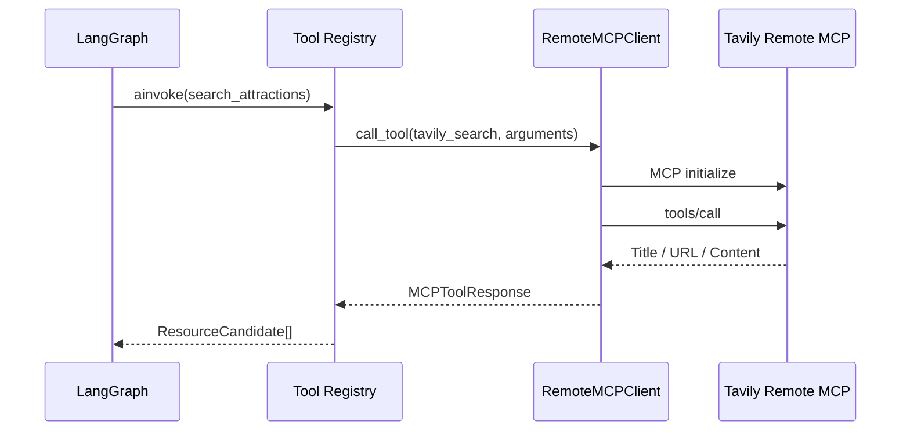

# 11｜Tavily MCP 真实搜索

## 1. 目标

资源研究节点需要根据目的地、产品主题和目标人群获得当前网页信息，同时保留来源和检索时间。项目使用 Tavily Remote MCP，而不是直接调用 Tavily REST SDK，使搜索能力以标准 MCP Tool 的形式接入。

## 2. 调用链



`search_attractions` 定义在 `app/tools/travel.py`，内部复用 `TavilyMCPService`（`app/services/tavily_mcp.py`）。

## 3. 传输与鉴权

- Transport：MCP Streamable HTTP。
- Server：`https://mcp.tavily.com/mcp`。
- Tool：`tavily_search`。
- 鉴权：`Authorization: Bearer <TAVILY_API_KEY>`。
- SDK：官方 `mcp` Python SDK 1.x 稳定版本。

API Key 不拼接到 URL，不写入异常消息，也不会由健康检查返回（健康检查只返回 `tavily_mcp_configured` 布尔值）。

## 4. 搜索参数

系统将业务参数组合为检索问题：

```text
成都 旅游景点 活动 官方信息 开放时间 门票 地址；
主题：人文、美食；适合人群：亲子家庭
```

调用参数（`TavilyMCPService.search`）：

```json
{
  "query": "...",
  "topic": "general",
  "search_depth": "advanced",
  "max_results": 8,
  "include_images": true,
  "include_raw_content": false
}
```

- `include_images=true`：搜索附带图片，供多模态资源充实节点结合图片判断景点实况。
- 限制原始正文（`include_raw_content=false`）可以降低上下文体积和 Prompt Injection 风险。

## 5. 结果转换

Tavily MCP 的搜索结果支持两种解析：

- `parse_structured_results`：解析 MCP 返回的结构化 `results`（含 `images`）。
- `parse_tavily_search_text`：解析文本信封格式（`Title/URL/Content` 正则），兼容不同 MCP 实现。

统一转换为 `ResourceCandidate`：

```json
{
  "id": "web-3a35f...",
  "name": "成都武侯祠官方参观指南",
  "category": "web_resource",
  "location": "成都",
  "opening_hours": "需在官方渠道二次确认",
  "evidence": "Tavily MCP / https://... / 2026-07-30",
  "source_url": "https://...",
  "source_title": "成都武侯祠官方参观指南",
  "retrieved_at": "2026-07-30T10:00:00Z",
  "provider": "tavily_mcp",
  "summary": "搜索摘要……",
  "images": ["https://..."]
}
```

网页摘要不能被直接当成最终票价或库存。`opening_hours` 和价格等高时效字段由 LLM 充实估算，并标记为待官方确认。

## 6. 防护与失败处理

防护（`app/services/guard.py`）在检索节点实时生效：

- `scan_content` 检测 Prompt Injection 模式（指令覆盖、角色劫持、工具调用注入等）。
- `is_safe_url` 按域名白名单/黑名单校验来源。
- `filter_resources` 过滤风险资源，其余资源带来源继续进入 LLM 上下文。

失败处理分两层：

- **工具层**：未配置 API Key 或 `TAVILY_SEARCH_ENABLED=false` 时，`search_attractions` 明确抛出 `MCPToolError`，不静默降级到演示数据。
- **节点层**：`retrieve_resources` 与高德 POI 双路并行检索（`asyncio.gather(return_exceptions=True)`），单路失败记录警告，另一路结果继续使用；两路都失败时资源列表为空并由后续节点容错。

> 早期版本在 `app/config.py` 中保留过 `tavily_fallback_to_demo` 字段，现已移除；`tests/conftest.py` 中设置的 `TAVILY_FALLBACK_TO_DEMO` 环境变量会被配置忽略，测试通过 Mock 工具实现离线运行。

## 7. 异步 Tool Registry

MCP 是异步网络调用，因此 Tool Registry 同时支持：

- `invoke`：同步计算工具。
- `ainvoke`：异步 MCP 或其他 I/O 工具。

若错误地使用 `invoke` 调用异步 Tool，Registry 会立即报错，避免未等待的协程继续进入工作流。`ainvoke` 用于所有异步 I/O 工具（如 MCP 网络调用）。

## 8. 测试

自动化测试不会消耗 Tavily 配额（`tests/test_tools.py`）：

- Tavily 文本结果解析。
- 来源 URL 和检索时间写入。
- `search_attractions` 在配置密钥时走 MCP 分支（Fake Service）。
- 异步 Tool 必须通过 `ainvoke` 调用。
- 未配置密钥时抛出 `MCPToolError`。

## 9. 后续增强

1. 使用域名白名单优先召回政府、文旅局和景区官网。
2. 增加 `tavily_extract` 二次提取开放时间与票价。
3. 对 URL 去重并缓存短时间内的相同查询。
4. 把来源纳入版本快照持久化，记录方案与证据的关系。
5. ~~对外部文本做 Prompt Injection 检测~~ ✅ 已实现（`app/services/guard.py`）。
6. ~~接入地图 API 验证真实坐标和交通时间~~ ✅ 已实现（高德 POI / 真实路径时长）。
